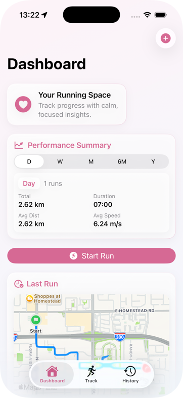
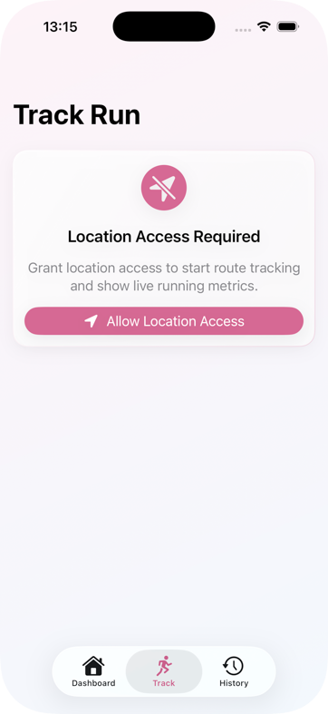
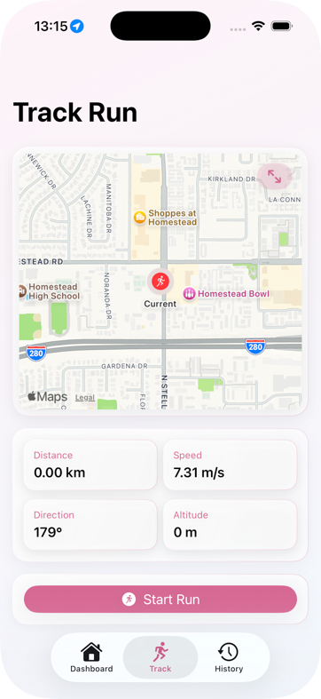
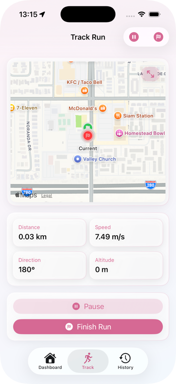
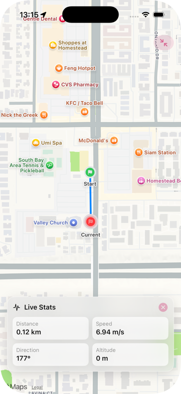
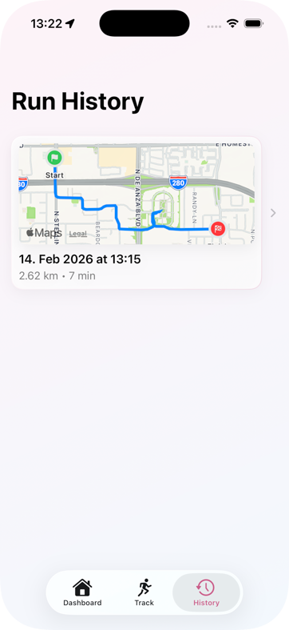
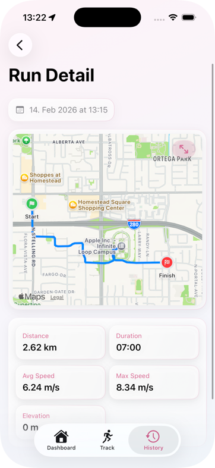

# SimpleRunningTracker

SimpleRunningTracker is an open-source SwiftUI sample project designed as a **handoff-ready scaffold** for junior and intermediate iOS developers.

The intent is to provide a practical, maintainable baseline that demonstrates MVVM structure, scene-owned navigation, protocol-based dependencies, CoreLocation authorization handling, and actor-backed persistence.

## Screenshots










## Project Intent

- Provide a clean SwiftUI architecture baseline for a running tracker app.
- Keep responsibilities separated (UI, navigation, state, location, persistence).
- Demonstrate permission-first location tracking before map rendering and run capture.
- Provide a learning-focused codebase that can evolve toward production.

## Tech Stack

- Swift 6
- SwiftUI + MapKit
- CoreLocation (authorization + location updates)
- Async/await + AsyncStream for state updates
- Actor-based JSON persistence in Documents directory

## Current Structure

```text
SimpleRunningTracker/
  Components/   # Reusable UI components
  Models/       # Domain models
  Protocols/    # Protocol contracts
  Routes/       # Route enums for scene navigation
  Scenes/       # Navigation roots
  Services/     # Concrete location/store implementations + service container
  ViewModels/   # Presentation/business logic
  Views/        # Screen UI
```

## App Flow

1. App launches into a single `TabView` hosted in `ContentView`.
2. `DashboardScene` shows quick insight from the most recent run and provides a `Start Run` action.
3. `RunTrackingScene` gates map/tracking by location authorization state:
   - If not authorized: permission UI is shown.
   - If authorized: live map route + speed, distance, direction, altitude are shown.
4. Finishing a run persists route + metrics to Documents directory JSON.
5. `RunHistoryScene` lists all runs and pushes `RunDetailView` as a child destination.
6. `RunDetailView` shows the full route and recorded metrics for a selected run.

## Persistence

Run data is persisted to a JSON file in the app Documents directory by `RunStore`.

- Store: `SimpleRunningTracker/Services/RunStore.swift`
- Protocol: `SimpleRunningTracker/Protocols/RunStoreProtocol.swift`

## Build

From project root:

```bash
xcodebuild -project SimpleRunningTracker.xcodeproj -scheme SimpleRunningTracker -destination 'platform=iOS Simulator,name=iPhone 17 Pro' build
```
